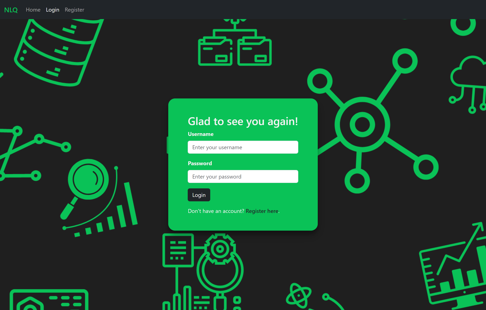
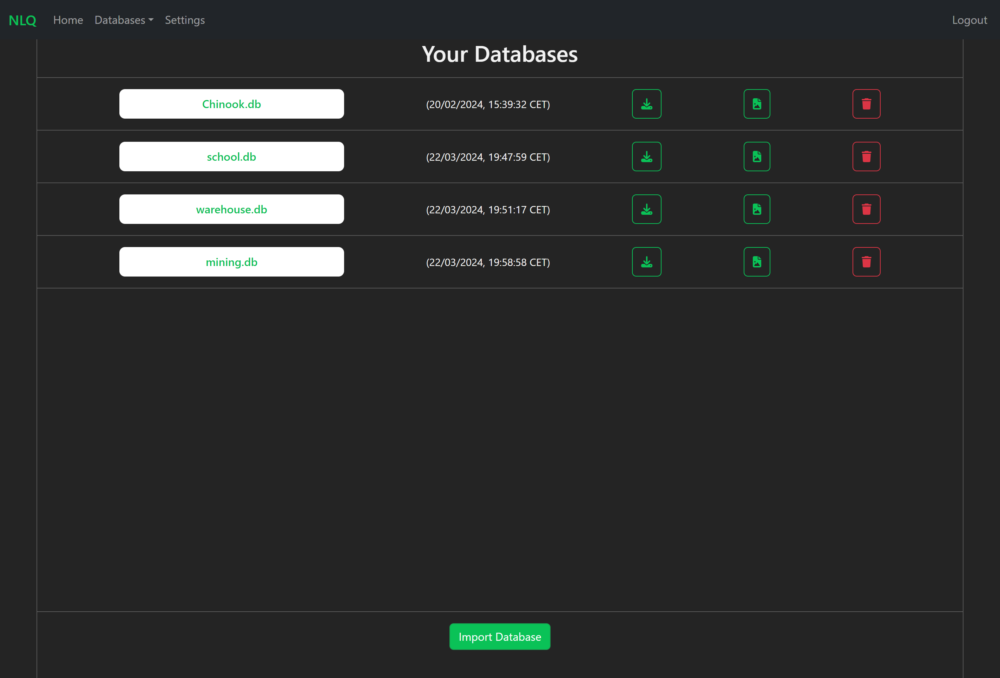
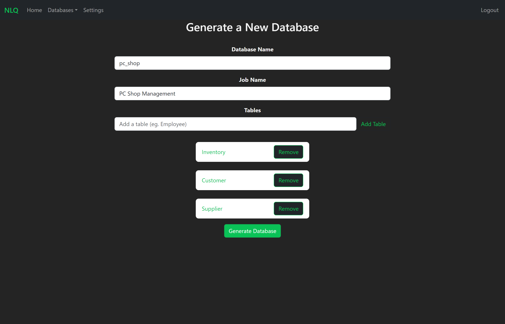
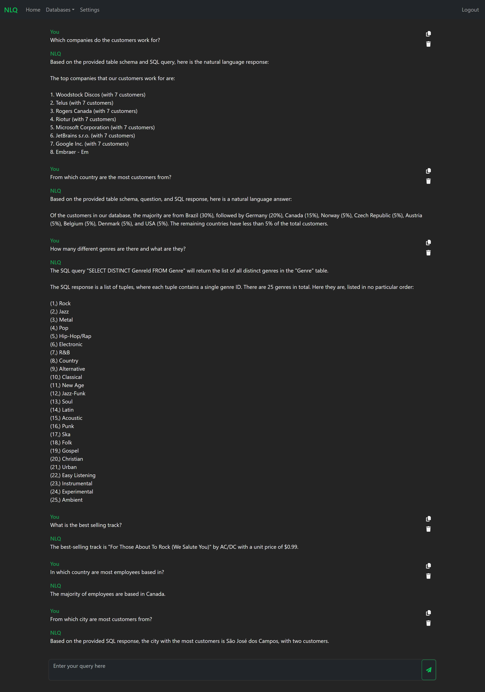

# 🚀 Natural Language Querying (NLQ) 🚀
NLQ is an innovative web application that revolutionizes the way users interact with databases by enabling natural language-powered database querying.
## Table of Contents
- [Introduction](#introduction)
- [App Showcase](#app-showcase)
- [Key Features](#key-features)
- [Technologies Used ](#technologies-used)
- [Installation and Usage](#installation-and-usage)
- [REST API](#rest-api)
- [Additional Functionalities](#additional-functionalities)
- [License](#license)

## Introduction

NLQ simplifies the database interaction process, allowing users to effortlessly perform complex queries using natural language. The application provides a user-friendly interface for importing, managing databases, and querying data seamlessly.

## App Showcase

This section provides in-app screenshots (full-size) of different pages and functionalities.

<h3 align="center">Login</h3>

<h3 align="center">User Databases</h3>

<h3 align="center">Generate Databases</h3>

<h3 align="center">Query a Database using NL</h3>

## Key Features

- **Natural Language Querying**: Perform queries using natural language.
- **Database Management**: Import, view, and manage databases effortlessly.
- **User-friendly Interface**: Intuitive UI for a seamless experience.
- **Database ERD**: Generate ER diagrams to visually represent user-imported databases.
- **Database Generation**: Generate database schema based on user input (tables, name, etc.).

## Technologies Used

- **React.js**: Building the user interface components and managing the frontend.
- **Node.js**: Backend server for handling requests and communication with the database.
- **MongoDB**: NoSQL database for storing user and application data.
- **Express.js**: Framework for building the backend API.
- **Bootstrap**: CSS framework for enhancing the application's design.
- **LangChain**: ...
- **Python Flask**: Powers the NL->SQL->NL conversion server, providing seamless natural language conversion.

## Installation and Usage

For installation and usage guidance and information, refer to [Installation Documentation](INSTALLATION.md).
   
## REST API

NLQ employs a RESTful API for communication between the frontend and backend. The API includes endpoints for user authentication, database management, and querying.

For detailed API documentation, refer to [API Documentation](API_DOCUMENTATION.md).

## Additional Functionalities

- **Database Import**: Easily import databases in various formats.
- **User Authentication**: Secure user authentication for personalized experiences.
- **Database Querying**: Perform complex queries using a natural language interface.
- **Error Handling**: Robust error handling for a smooth user experience.

## License
This project is licensed under the [Apache 2.0 License](LICENSE).

 
