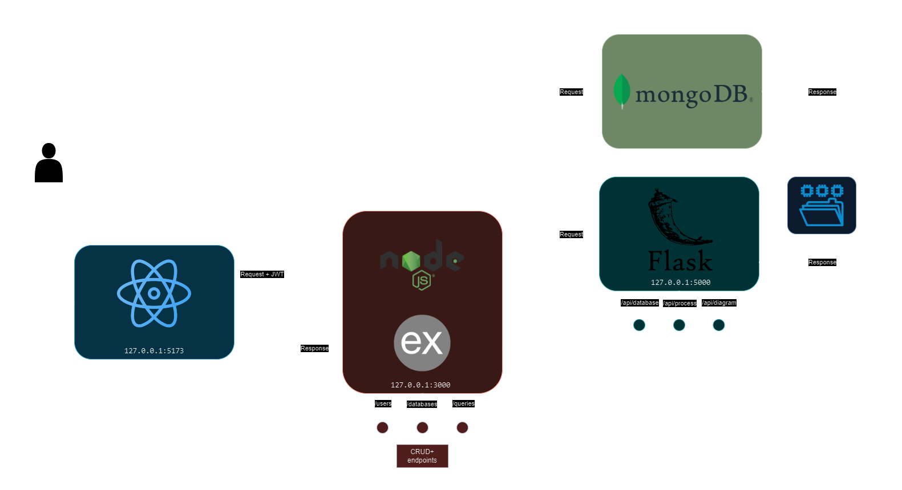

# System Diagrams

<h3 align="center">API Diagram</h3>

<h3 align="center">Flask Endpoints Workflow</h3>

<h3 align="center">NL2SQL2NL Chain Workflow</h3>

<h3 align="center">DB Generation Chain Workflow</h3>

<h3 align="center">Flask Custom Modules Class Diagram</h3>

